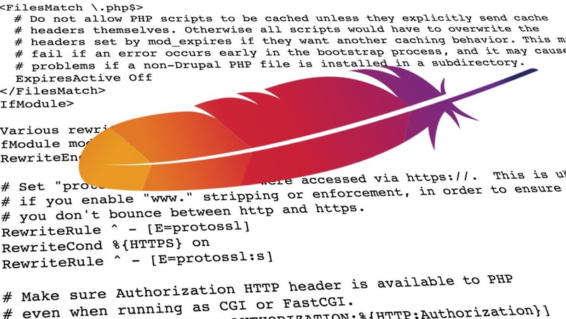

# Htaccess Manager



## Summary

A PHP tool for .htaccess management in your web projects.

* Allows you to include _.htaccess_ files in other _.htaccess_ files.
* Work with smaller files then combine using `./bin/htaccess build`
* Share common snippets across different _.htaccess_ files.
* Simplified URL redirection; remap old URLs to new without nasty syntax.
* Merge in remote _.htaccess_ source files on build (think Drupal web root _.htaccess_ + custom _.htaccess_ directives).
* Manage banned IPs in a separate file or add them to the YAML configuration.

## Quick Start

- Create a YAML configuration file in a secure location in your project.
- Refer to _config.example.yml_ as a guide and optionally, delete when done.
- Lastly, build your files using `./vendor/bin/htaccess build path/to/your/config.yml`

## Install with Composer

1. This package requires some unpublished packages.  You must add the following to _composer.json_ in
   the `repositories` array:

    ```json
    {
     "type": "github",
     "url": "https://github.com/aklump/json-schema-loading"
    },
    {
     "type": "github",
     "url": "https://github.com/aklump/json-schema-validation"
    },
    {
     "type": "github",
     "url": "https://github.com/aklump/json-schema-merge"
    }
    ```
1. Require this package:
   
    ```
    composer require --dev aklump/htaccess-manager:^0.0
    ```

## Configuration Special Notes

* You must list one or more hosts in `valid_hosts`, including their http or https protocol.
* Forced SSL redirection is detected based on the `valid_hosts` array; `force_ssl` will be set to `true` if all `valid_hosts` use the _https_ protocol. You may override auto-detection by setting `force_ssl` to `true` or `false`.
* Adding or removing `www.` is detected based on the `valid_hosts` array. It is set to `add` if all `valid_hosts` have `www.`, `remove` if all `valid_hosts` do not have `www.`. When neither `add` nor `remove` no redirection takes place. You may override auto-detection by setting `www_prefix` to `add`, `remove`, or `default`.

## Usage

- To view help execute `./vendor/bin/htaccess`

## Contributing

If you find this project useful... please consider [making a donation](https://www.paypal.com/cgi-bin/webscr?cmd=_s-xclick&hosted_button_id=4E5KZHDQCEUV8&item_name=Gratitude%20for%20aklump%2Fhtaccess-manager).

## More Reading

* [THE Ultimate Htaccess](https://www.askapache.com/htaccess)
* [Mod_Rewrite Variables Cheatsheet](https://www.askapache.com/htaccess/mod_rewrite-variables-cheatsheet/)
* [Htaccess](https://www.askapache.com/category/htaccess/)

## Troubleshooting

### 4xx redirects are not working

I'm not sure why, but on some servers they do not work. Possible reasons:

1. Apache version?
2. VirtualHost config hijacking?
3. Drupal conflict?
